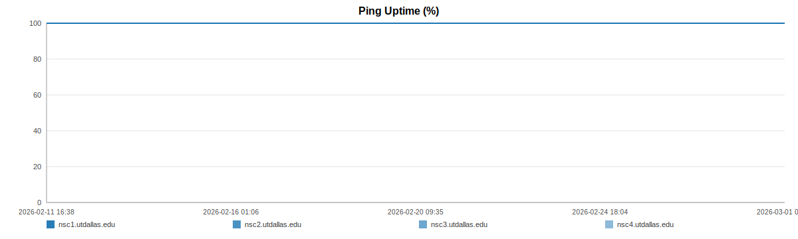
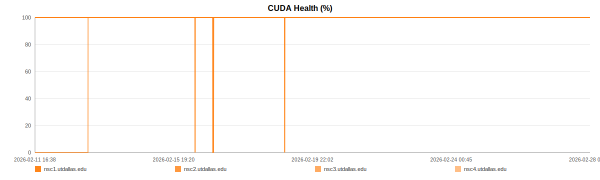
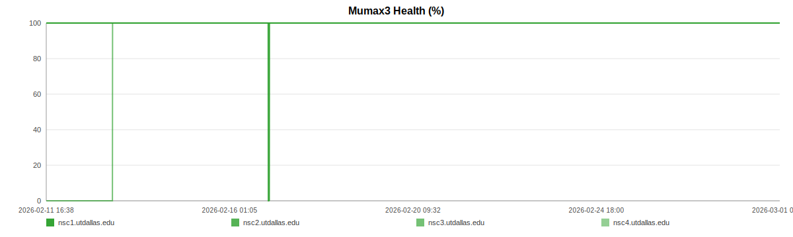
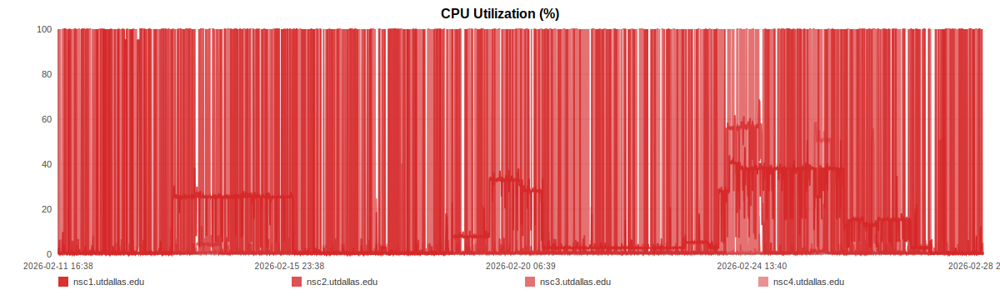
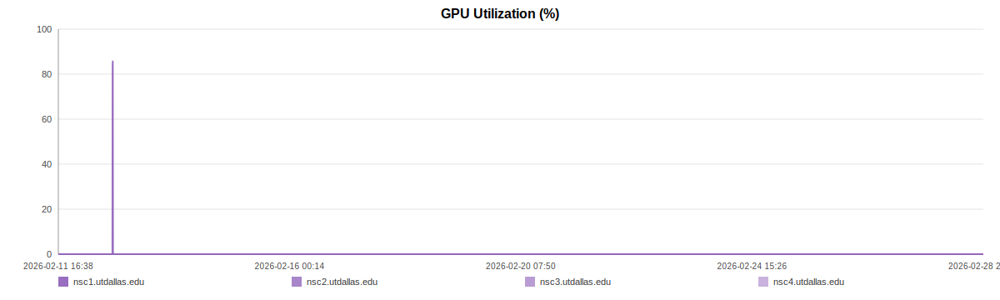

# Server Status Dashboard

Updated: **2026-02-15T22:47:22Z**

## Current Fleet Status

| Server | Ping | CUDA | Mumax3 | CPU util. | GPU util. | CPU(logical/physical) | GPU count |
| ------ | ---- | ---- | ------ | --------- | --------- | -------------------- | --------- |
| nsc1.utdallas.edu | :white_check_mark: online | :white_check_mark: ok | :white_check_mark: ok | 25.50% | 0.00% | 38/20 | 1 |
| nsc2.utdallas.edu | :white_check_mark: online | :white_check_mark: ok | :white_check_mark: ok | 0.60% | 0.00% | 16/8 | 1 |
| nsc3.utdallas.edu | :white_check_mark: online | :white_check_mark: ok | :white_check_mark: ok | 100.00% | 0.00% | 24/12 | 2 |
| nsc4.utdallas.edu | :white_check_mark: online | :white_check_mark: ok | :white_check_mark: ok | 0.40% | 0.00% | 24/12 | 2 |

## Hardware Inventory (latest known)

| Server | Logical CPUs | Physical CPUs | GPU count | GPU model(s) | RAM total (GB) |
| ------ | ------------ | ------------- | --------- | ------------ | -------------- |
| nsc1.utdallas.edu | 38 | 20 | 1 | Tesla P100-PCIE-16GB | 125.16 |
| nsc2.utdallas.edu | 16 | 8 | 1 | NVIDIA GeForce GTX 1080 Ti | 31.02 |
| nsc3.utdallas.edu | 24 | 12 | 2 | NVIDIA GeForce RTX 2080 Ti;NVIDIA GeForce RTX 2080 Ti | 31.01 |
| nsc4.utdallas.edu | 24 | 12 | 2 | NVIDIA GeForce RTX 2080 Ti;NVIDIA GeForce RTX 2080 Ti | 30.96 |

## Reliability & Utilization (all samples)

| Server | Samples | Ping uptime | CUDA healthy | Mumax3 healthy | Avg CPU util. | Avg GPU util. | CPU>85% samples | GPU>90% samples |
| ------ | ------- | ----------- | ------------ | -------------- | ------------- | ------------- | --------------- | --------------- |
| nsc1.utdallas.edu | 1128 | 100.00% | 100.00% | 100.00% | 15.03% | 0.15% | 26 | 0 |
| nsc2.utdallas.edu | 1129 | 100.00% | 100.00% | 100.00% | 15.10% | 0.00% | 164 | 0 |
| nsc3.utdallas.edu | 1129 | 100.00% | 63.24% | 63.24% | 19.78% | 0.00% | 213 | 0 |
| nsc4.utdallas.edu | 1129 | 100.00% | 100.00% | 100.00% | 0.67% | 0.00% | 0 | 0 |

## SLO Rollups

| Server | Window | Ping uptime | CUDA healthy | Mumax3 healthy |
| ------ | ------ | ----------- | ------------ | -------------- |
| nsc1.utdallas.edu | 24h | 100.00% | 100.00% | 100.00% |
| nsc1.utdallas.edu | 7d | 100.00% | 100.00% | 100.00% |
| nsc1.utdallas.edu | 30d | 100.00% | 100.00% | 100.00% |
| nsc2.utdallas.edu | 24h | 100.00% | 100.00% | 100.00% |
| nsc2.utdallas.edu | 7d | 100.00% | 100.00% | 100.00% |
| nsc2.utdallas.edu | 30d | 100.00% | 100.00% | 100.00% |
| nsc3.utdallas.edu | 24h | 100.00% | 100.00% | 100.00% |
| nsc3.utdallas.edu | 7d | 100.00% | 63.24% | 63.24% |
| nsc3.utdallas.edu | 30d | 100.00% | 63.24% | 63.24% |
| nsc4.utdallas.edu | 24h | 100.00% | 100.00% | 100.00% |
| nsc4.utdallas.edu | 7d | 100.00% | 100.00% | 100.00% |
| nsc4.utdallas.edu | 30d | 100.00% | 100.00% | 100.00% |

## Incidents & State Changes (latest 25 transitions)

| Timestamp (UTC) | Server | Signal | Transition |
| --------------- | ------ | ------ | ---------- |
| 2026-02-13T06:24:11Z | nsc3.utdallas.edu | CUDA | error -> ok |
| 2026-02-13T06:24:11Z | nsc3.utdallas.edu | Mumax3 | error -> ok |

## Historical Plots

## Recent Samples

Expand to view the latest 60 samples

| Timestamp (UTC) | Server | Ping | CUDA | Mumax3 | CPU util. | GPU util. | CPU(logical/physical) | GPU count | RAM GB |
| --------------- | ------ | ---- | ---- | ------ | --------- | --------- | -------------------- | --------- | ------ |
| 2026-02-15T21:31:05Z | nsc2.utdallas.edu | online | ok | ok | 1.20% | 0.00% | 16/8 | 1 | 31.02 |
| 2026-02-15T21:31:05Z | nsc3.utdallas.edu | online | ok | ok | 100.00% | 0.00% | 24/12 | 2 | 31.01 |
| 2026-02-15T21:31:05Z | nsc4.utdallas.edu | online | ok | ok | 0.40% | 0.00% | 24/12 | 2 | 30.96 |
| 2026-02-15T21:36:32Z | nsc1.utdallas.edu | online | ok | ok | 25.50% | 0.00% | 38/20 | 1 | 125.16 |
| 2026-02-15T21:36:32Z | nsc2.utdallas.edu | online | ok | ok | 0.30% | 0.00% | 16/8 | 1 | 31.02 |
| 2026-02-15T21:36:32Z | nsc3.utdallas.edu | online | ok | ok | 0.40% | 0.00% | 24/12 | 2 | 31.01 |
| 2026-02-15T21:36:32Z | nsc4.utdallas.edu | online | ok | ok | 0.60% | 0.00% | 24/12 | 2 | 30.96 |
| 2026-02-15T21:42:01Z | nsc1.utdallas.edu | online | ok | ok | 25.30% | 0.00% | 38/20 | 1 | 125.16 |
| 2026-02-15T21:42:01Z | nsc2.utdallas.edu | online | ok | ok | 100.00% | 0.00% | 16/8 | 1 | 31.02 |
| 2026-02-15T21:42:01Z | nsc3.utdallas.edu | online | ok | ok | 0.80% | 0.00% | 24/12 | 2 | 31.01 |
| 2026-02-15T21:42:01Z | nsc4.utdallas.edu | online | ok | ok | 0.60% | 0.00% | 24/12 | 2 | 30.96 |
| 2026-02-15T21:47:23Z | nsc1.utdallas.edu | online | ok | ok | 25.30% | 0.00% | 38/20 | 1 | 125.16 |
| 2026-02-15T21:47:23Z | nsc2.utdallas.edu | online | ok | ok | 0.30% | 0.00% | 16/8 | 1 | 31.02 |
| 2026-02-15T21:47:23Z | nsc3.utdallas.edu | online | ok | ok | 0.20% | 0.00% | 24/12 | 2 | 31.01 |
| 2026-02-15T21:47:23Z | nsc4.utdallas.edu | online | ok | ok | 0.60% | 0.00% | 24/12 | 2 | 30.96 |
| 2026-02-15T21:52:46Z | nsc1.utdallas.edu | online | ok | ok | 25.30% | 0.00% | 38/20 | 1 | 125.16 |
| 2026-02-15T21:52:46Z | nsc2.utdallas.edu | online | ok | ok | 0.60% | 0.00% | 16/8 | 1 | 31.02 |
| 2026-02-15T21:52:46Z | nsc3.utdallas.edu | online | ok | ok | 0.20% | 0.00% | 24/12 | 2 | 31.01 |
| 2026-02-15T21:52:46Z | nsc4.utdallas.edu | online | ok | ok | 0.60% | 0.00% | 24/12 | 2 | 30.96 |
| 2026-02-15T21:58:13Z | nsc1.utdallas.edu | online | ok | ok | 25.40% | 0.00% | 38/20 | 1 | 125.16 |
| 2026-02-15T21:58:13Z | nsc2.utdallas.edu | online | ok | ok | 0.30% | 0.00% | 16/8 | 1 | 31.02 |
| 2026-02-15T21:58:13Z | nsc3.utdallas.edu | online | ok | ok | 0.40% | 0.00% | 24/12 | 2 | 31.01 |
| 2026-02-15T21:58:13Z | nsc4.utdallas.edu | online | ok | ok | 0.40% | 0.00% | 24/12 | 2 | 30.96 |
| 2026-02-15T22:03:38Z | nsc1.utdallas.edu | online | ok | ok | 25.30% | 0.00% | 38/20 | 1 | 125.16 |
| 2026-02-15T22:03:38Z | nsc2.utdallas.edu | online | ok | ok | 0.30% | 0.00% | 16/8 | 1 | 31.02 |
| 2026-02-15T22:03:38Z | nsc3.utdallas.edu | online | ok | ok | 0.20% | 0.00% | 24/12 | 2 | 31.01 |
| 2026-02-15T22:03:38Z | nsc4.utdallas.edu | online | ok | ok | 0.40% | 0.00% | 24/12 | 2 | 30.96 |
| 2026-02-15T22:09:02Z | nsc1.utdallas.edu | online | ok | ok | 25.30% | 0.00% | 38/20 | 1 | 125.16 |
| 2026-02-15T22:09:02Z | nsc2.utdallas.edu | online | ok | ok | 1.20% | 0.00% | 16/8 | 1 | 31.02 |
| 2026-02-15T22:09:02Z | nsc3.utdallas.edu | online | ok | ok | 100.00% | 0.00% | 24/12 | 2 | 31.01 |
| 2026-02-15T22:09:02Z | nsc4.utdallas.edu | online | ok | ok | 0.40% | 0.00% | 24/12 | 2 | 30.96 |
| 2026-02-15T22:14:26Z | nsc1.utdallas.edu | online | ok | ok | 25.50% | 0.00% | 38/20 | 1 | 125.16 |
| 2026-02-15T22:14:26Z | nsc2.utdallas.edu | online | ok | ok | 2.10% | 0.00% | 16/8 | 1 | 31.02 |
| 2026-02-15T22:14:26Z | nsc3.utdallas.edu | online | ok | ok | 0.20% | 0.00% | 24/12 | 2 | 31.01 |
| 2026-02-15T22:14:26Z | nsc4.utdallas.edu | online | ok | ok | 0.40% | 0.00% | 24/12 | 2 | 30.96 |
| 2026-02-15T22:20:16Z | nsc1.utdallas.edu | online | ok | ok | 25.50% | 0.00% | 38/20 | 1 | 125.16 |
| 2026-02-15T22:20:16Z | nsc2.utdallas.edu | online | ok | ok | 0.90% | 0.00% | 16/8 | 1 | 31.02 |
| 2026-02-15T22:20:16Z | nsc3.utdallas.edu | online | ok | ok | 0.40% | 0.00% | 24/12 | 2 | 31.01 |
| 2026-02-15T22:20:16Z | nsc4.utdallas.edu | online | ok | ok | 0.80% | 0.00% | 24/12 | 2 | 30.96 |
| 2026-02-15T22:25:39Z | nsc1.utdallas.edu | online | ok | ok | 25.50% | 0.00% | 38/20 | 1 | 125.16 |
| 2026-02-15T22:25:39Z | nsc2.utdallas.edu | online | ok | ok | 0.30% | 0.00% | 16/8 | 1 | 31.02 |
| 2026-02-15T22:25:39Z | nsc3.utdallas.edu | online | ok | ok | 0.20% | 0.00% | 24/12 | 2 | 31.01 |
| 2026-02-15T22:25:39Z | nsc4.utdallas.edu | online | ok | ok | 1.10% | 0.00% | 24/12 | 2 | 30.96 |
| 2026-02-15T22:31:08Z | nsc1.utdallas.edu | online | ok | ok | 25.50% | 0.00% | 38/20 | 1 | 125.16 |
| 2026-02-15T22:31:08Z | nsc2.utdallas.edu | online | ok | ok | 0.60% | 0.00% | 16/8 | 1 | 31.02 |
| 2026-02-15T22:31:08Z | nsc3.utdallas.edu | online | ok | ok | 0.40% | 0.00% | 24/12 | 2 | 31.01 |
| 2026-02-15T22:31:08Z | nsc4.utdallas.edu | online | ok | ok | 0.60% | 0.00% | 24/12 | 2 | 30.96 |
| 2026-02-15T22:36:33Z | nsc1.utdallas.edu | online | ok | ok | 25.40% | 0.00% | 38/20 | 1 | 125.16 |
| 2026-02-15T22:36:33Z | nsc2.utdallas.edu | online | ok | ok | 100.00% | 0.00% | 16/8 | 1 | 31.02 |
| 2026-02-15T22:36:33Z | nsc3.utdallas.edu | online | ok | ok | 0.20% | 0.00% | 24/12 | 2 | 31.01 |
| 2026-02-15T22:36:33Z | nsc4.utdallas.edu | online | ok | ok | 0.40% | 0.00% | 24/12 | 2 | 30.96 |
| 2026-02-15T22:42:02Z | nsc1.utdallas.edu | online | ok | ok | 25.30% | 0.00% | 38/20 | 1 | 125.16 |
| 2026-02-15T22:42:02Z | nsc2.utdallas.edu | online | ok | ok | 100.00% | 0.00% | 16/8 | 1 | 31.02 |
| 2026-02-15T22:42:02Z | nsc3.utdallas.edu | online | ok | ok | 0.20% | 0.00% | 24/12 | 2 | 31.01 |
| 2026-02-15T22:42:02Z | nsc4.utdallas.edu | online | ok | ok | 0.60% | 0.00% | 24/12 | 2 | 30.96 |
| 2026-02-15T22:47:22Z | nsc1.utdallas.edu | online | ok | ok | 25.50% | 0.00% | 38/20 | 1 | 125.16 |
| 2026-02-15T22:47:22Z | nsc2.utdallas.edu | online | ok | ok | 0.60% | 0.00% | 16/8 | 1 | 31.02 |
| 2026-02-15T22:47:22Z | nsc3.utdallas.edu | online | ok | ok | 100.00% | 0.00% | 24/12 | 2 | 31.01 |
| 2026-02-15T22:47:22Z | nsc4.utdallas.edu | online | ok | ok | 0.40% | 0.00% | 24/12 | 2 | 30.96 |

## How checks work

1. **Ping**: ICMP ping from the monitoring host.
2. **CUDA health**: SSH + `nvidia-smi --query-gpu=utilization.gpu --format=csv,noheader,nounits`.
3. **Mumax3 health**: SSH + `mumax3 -version` (fallback to `mumax3 -v` / `mumax3`).
4. **CPU utilization**: SSH + `top` (fallback `vmstat`) parsed as active CPU%.
5. **Hardware inventory**: SSH + `nproc`, `lscpu`, `nvidia-smi`, and `/proc/meminfo`.

## GitHub-first rendering notes

- README only uses GitHub-supported Markdown tables and static SVG images.
- Interactive JavaScript charts are intentionally avoided so everything renders directly on GitHub.
